# azure_effortless_demo
A demo of Chef's Effortless patterns running in an Azure DevOps Pipeline

## Repo Purpose

The purpose of this repository is to demonstrate Chef's Effortless patterns in an Azure DevOps pipeline. We'll start by creating an A2 server, then use Packer along with Chef's Effortless Config and Effortless Audit patterns to produce a Windows 2016 operating system image hardened and patched to the DevSec Baseline hardening standard (https://github.com/dev-sec/windows-baseline), then use Terraform to spin up a Windows 2016 VM using that image that can be used to run application workloads. And at every stage of the process, we'll be able to visualise the compliance status of both our operating system pipeline and provisioned instances in A2!

## Demo Pre-requisites

There are a number of pre-requisites for this demo that you will need to run it successfully - these are outlined here!

### Azure Extensions

This pipeline makes use of a number of extensions for Azure Devops available on the Azure marketplace. You'll need to make sure you have all of the following added to your Azure DevOps organisation:

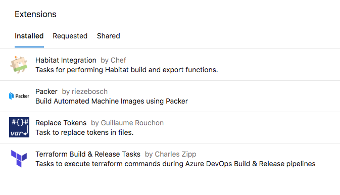

### Azure Credentials
As the demo runs in Microsoft Azure Devops, you'll need to have an active subscription to that service. You'll also need to make sure you have the folliwing information from Azure to make use of this demo:

* Azure Subscription ID
* Azure Subscription Name
* Azure Tenant ID
* Azure Client ID
* Azure Client Secret

The last three items in that list are generated by creating an Azure application and associated service principal in the Azure Portal. You can find out more about how to do this here: https://docs.microsoft.com/en-us/azure/active-directory/develop/howto-create-service-principal-portal

### Other Azure Resources

You'll also need to make sure that you have created the following items in your Azure Subscription - these will be used to store our Terraform state file when running the pipeline:

* A resource group
* A storage account
* A "blob" storage container within that storage account

Make sure you've noted down the name of the above, as you'll need them for the demo to work successfully!

## Demo Setup

### Fork Github Repository

The first step in getting this demo up and running is to fork this Github repository to the source control system of your choice - you'll need to do this to be able to connect to the repository through Azure Devops. 

### Create Pipeline

Once you've created a fork of the Github repository, you'll next want to create a new Pipeline in Azure Devops, and configure the pipeline to use the repository you created above. Azure will automatically detect the ```azure_pipelines.yml``` file included with this repository and prompt you to review it. 

We don't need to make any changes to the Azure Devops pipeline itself, so you can click the "Run" button in the top right corner to create your pipeline.

**PLEASE NOTE** Your pipeline will fail to run at this stage with the below error - this is normal, because your pipeline needs some information we have not yet given it. Don't worry, we'll move on to that next.

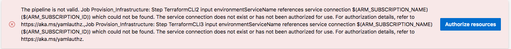

## Create Pipeline Variables

To give our pipeline the information it needs to continue, you'll want to make sure that you have added the following variables to your pipeline configuration - this can be done by clicking the "Edit" button on your pipeline, and then selecting the "Variables" button on the top right of the screen.

The first 8 variables (prefixed with ```ARM```) are the Azure credentials listed in the pre-requisites section. The remaining variables prefixed with ```TF``` control the configuration of how we will use Packer and Terraform to build and provision instances - the meaning of these variables is listed below:

* ```TF_RESOURCE_GROUP_NAME```: This is the name of the Azure resource group our storage account lives under
* ```TF_STORAGE_ACCOUNT_NAME```: This is the name of the Azure storage account we will be using to store our terraform state
* ```TF_CONTAINER_NAME```: This is the name of the Azure blob container under our storage account that we will store Terraform's state file in
* ```TF_KEY```: This is the name we will give Terraform's state file when we store it
* ```TF_MANAGED_IMAGE_NAME```: This is the name we will give to the hardened and patched Windows 2016 image we will create with Packer and subsequently consume with Terraform
* ```TF_INSTANCE_PASSWORD```: This is the administrator password instances created by Terraform will be provisioned with

Your list of created variables should look something like this:

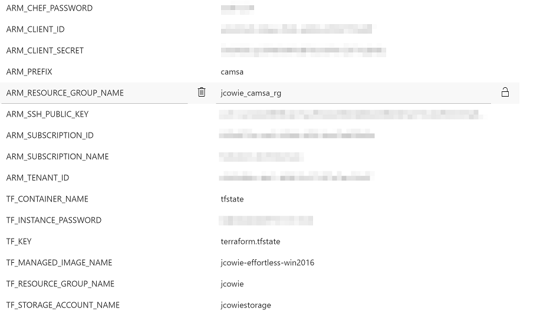

## Running the Pipeline

Now that we've completed the setup steps, we're ready to run our pipeline! To do this, click the "Queue" button at the top right of your pipeline as shown below, then click "Run" on the confirmation screen that appears.

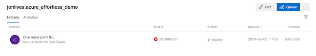

The first time you run the pipeline, you'll probably see an error like the below:

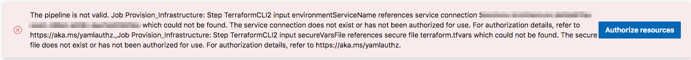

This is Azure letting us know that we need to authorize our pipeline to be able to create resources under the subscription ID we supplied. If your supplied subscription ID is correct, click "Authorize resources" and then queue another build of your pipeline, exactly the same as we did above.

This time, our pipeline should run successfully all the way through - screenshots are shown below of a successful pipeline run:

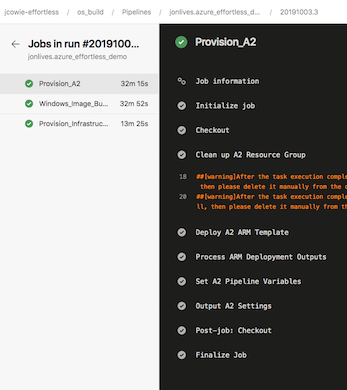

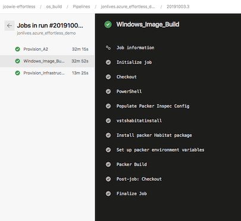

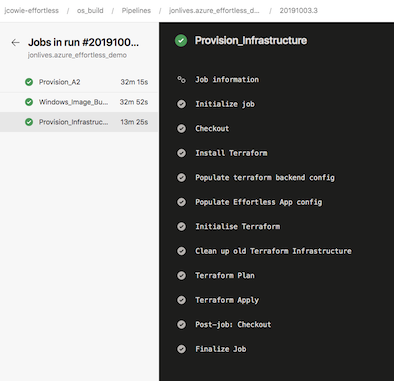

Additionally, you should be able to see the hardened and patched image in your Azure managed images store:

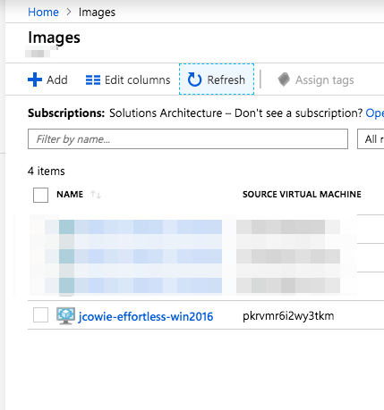

and the VM we created from that image along with all its supporting items in your Azure resource group:

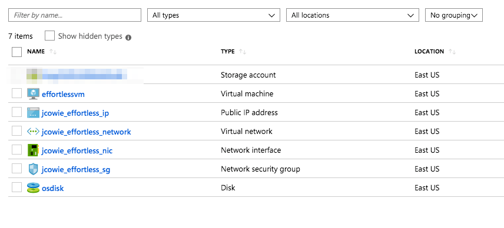

And finally, you'll be able to find the credentials to log in to your A2 instance in the pipeline output section shown - and you'll see the compliance status of both your OS image build and your provisioned instance in A2's Compliance view as shown here:

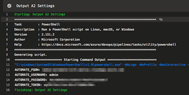

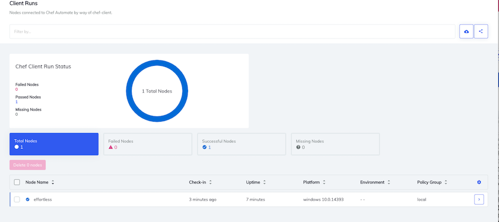

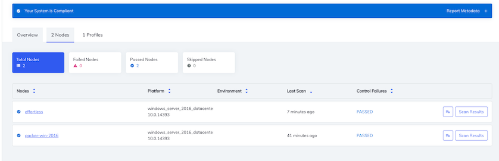